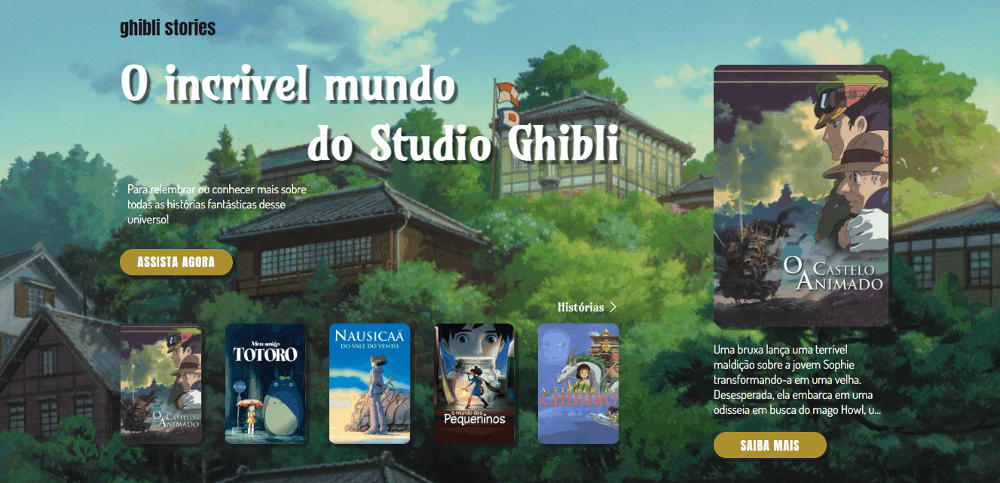

## Ghibli Stories

O Ghibli Stories é uma aplicação web que apresenta uma coleção de filmes do Studio Ghibli. Os pôsteres dos filmes são exibidos e, ao clicar em um pôster, informações detalhadas sobre o filme são mostradas na tela.

Link de acesso: https://emilaynerodrigues.github.io/ghibli-stories/

## Funcionalidades Principais

1. **Exibição dos pôsteres dos filmes do Studio Ghibli.
2. **Visualização das informações sobre cada filme ao clicar no respectivo pôster.
3. **Utilização da biblioteca Swiper.js para uma interface interativa e de fácil navegação.

## Tecnologias Utilizadas

- **HTML**: Para estruturação e marcação do conteúdo.
- **CSS/SCSS**: Para estilização e apresentação visual do site. 
- **JavaScript**: Para interatividade e dinamismo no carregamento e navegação do conteúdo.
- **Swiper.JS**: Para criação do swiper dos filmes.

- ## Demonstração

